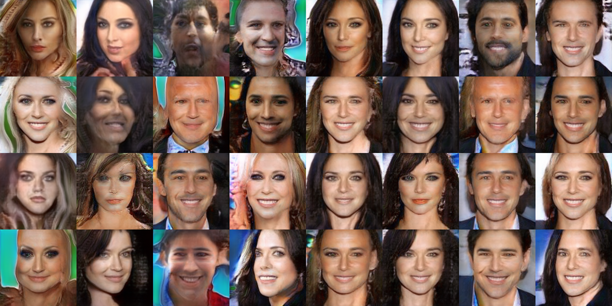
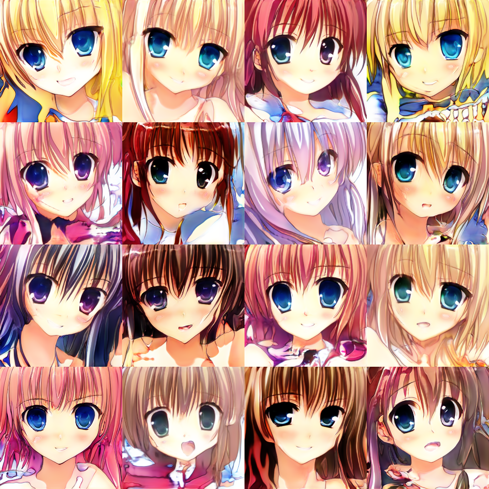

# PGGAN-TensorFlow
A implementation of PGGAN using TensorFlow

original paper: https://arxiv.org/abs/1710.10196

original implementation: https://github.com/tkarras/progressive_growing_of_gans

I referred https://github.com/tadax/pggan .

See also it.

## usage
put images in named "data" folder in this directory.

like this
```
main.py
pred.py
data
  ├ 000.jpg
  ├ aaa.png
  ...
  └ zzz.jpg
```

to train, run main.py.

```
python main.py
```

to inference, run pred.py.

```
python pred.py
```

## Result examples

leftmost: bicubic upsampling




